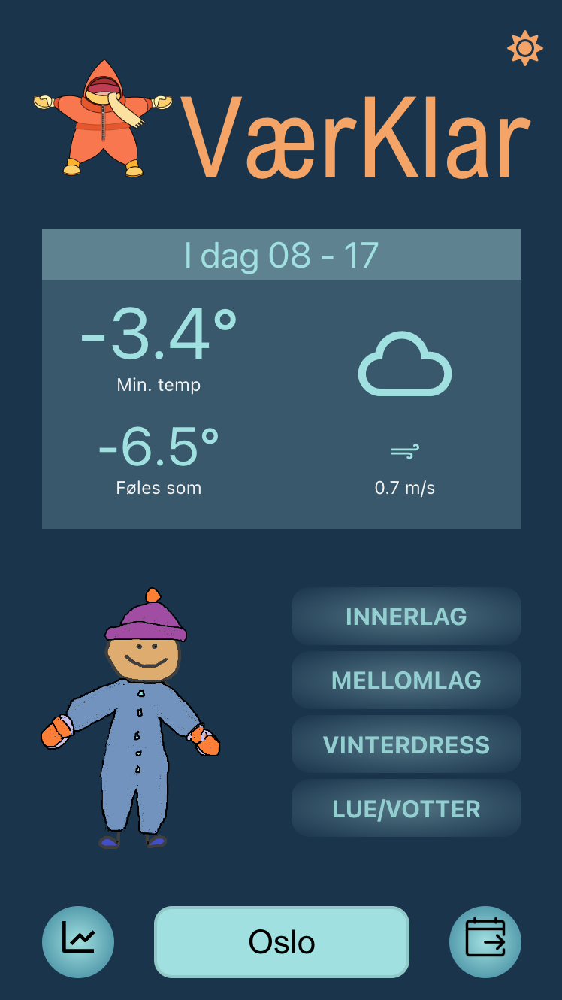
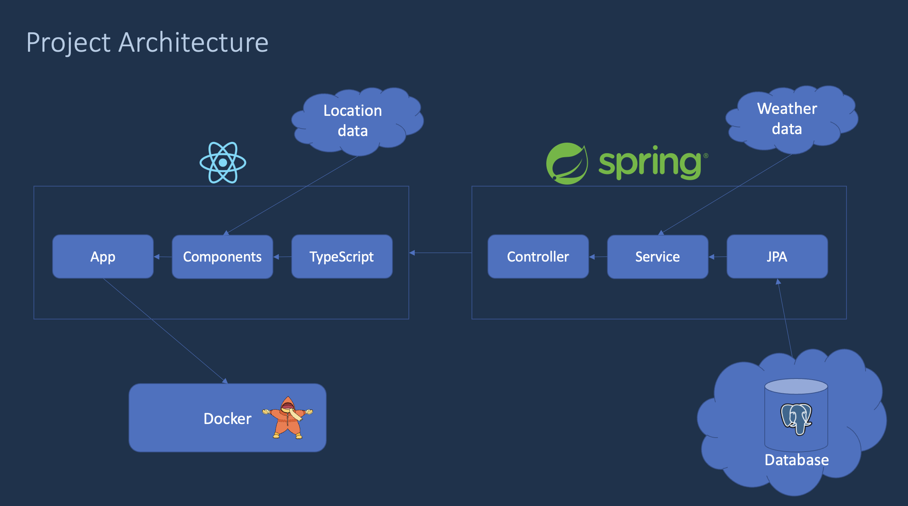

# Bundle Up

## Introduction
Bundle Up (VærKlar) is a user-friendly weather app designed to assist parents with dressing their children during the morning rush.
When you open the app, you immediately get the weather forecast for today in your current location and recommended clothing for the day as a cute animation and a clickable list of clothes/layers.
Clicking on an item brings up a popup with more information.

</img>

### Features
- The weather dashboard displays minimum temperature (actual and 'feels like') and maximum wind speed between 8 a.m. and 5 p.m.
- Toggle between the weather dashboard and graph views.
- Toggle between today's and tomorrow's forecast.
- Manually select any location.
- Toggle light/dark mode.

## Tech stack and architecture
We developed Bundle Up as a mobile-based web application with a Java Spring Boot backend and a React/TypeScript frontend, each packaged in separate Docker containers. The backend communicates with a cloud-based PostgreSQL database through Spring JPA and the front end through endpoints in the controller layer. We retrieved weather and location data from external REST APIs.

</img>
